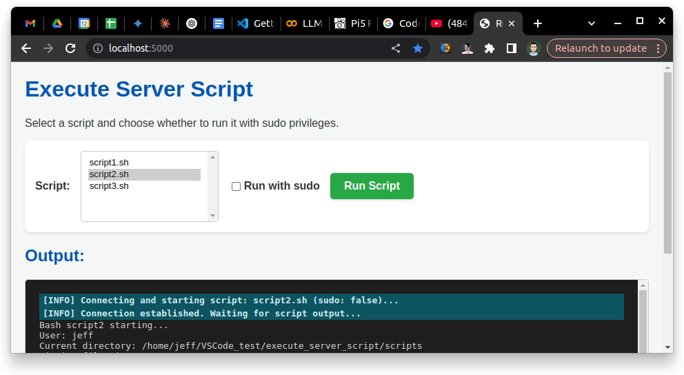

# Web Script Runner

This project provides a simple web interface to execute predefined bash scripts on the server where it's hosted.




## Features

*   Lists available bash scripts from a designated `scripts` directory.
*   Allows users to select a script to run.
*   Provides an option to execute the selected script with `sudo` privileges (requires server-side configuration).
*   Streams the script's standard output and standard error directly to the web page in real-time using Server-Sent Events (SSE).


## Setup

1.  **Clone/Download:** Get the project files onto your Ubuntu machine.
2.  **Create `scripts` Directory:** If it doesn't exist, create the `scripts` directory inside `webapp`.
3.  **Add Scripts:** Place your bash scripts inside the `webapp/scripts/` directory. Make sure they are executable:
    ```bash
    chmod +x webapp/scripts/*.sh
    ```
4.  **Install Dependencies:** Navigate to the `webapp` directory and install Flask:
    ```bash
    cd webapp
    pip install Flask
    # or: python3 -m pip install Flask
    ```
5.  **(Optional) Configure Sudo:** If any of your scripts require `sudo` and you want to allow running them with elevated privileges via the web interface:
    *   **Identify User:** Determine the user running the Flask app (e.g., `your_user`, `www-data`).
    *   **Edit Sudoers:** Run `sudo visudo`.
    *   **Add Rules:** Add a specific `NOPASSWD` rule for *each* script you want to allow sudo access for. **Never use a wildcard.** Replace `<user>` and the path accordingly.
        ```
        # Example: Allow 'www-data' user to run 'script_needs_sudo.sh' without password
        <user> ALL=(ALL) NOPASSWD: /full/path/to/your/webapp/scripts/script_needs_sudo.sh
        ```
    *   **Configure `app.py`:** Ensure `ALLOW_SUDO_FROM_UI = True` in `app.py` if you want the checkbox to attempt using `sudo`. Set it to `False` to disable this feature regardless of `sudoers` configuration.

## Running the Service

1.  Navigate to the `webapp` directory in your terminal:
    ```bash
    cd /path/to/your/webapp
    ```
2.  Run the Flask application:
    ```bash
    python app.py
    # or: python3 app.py
    ```
3.  Access the web interface in your browser, typically at `http://<your_server_ip>:5000`.

## Security Warning

Allowing web services to execute scripts, especially with `sudo`, is **inherently dangerous**.
*   Ensure the `scripts` directory and the scripts themselves are **not writable** by the user running the web server (e.g., `www-data`).
*   Only grant `sudo NOPASSWD` access to the **specific, necessary scripts**.
*   Thoroughly vet any script placed in the `scripts` directory.
*   Consider running the web service as a non-privileged user.
*   Set `ALLOW_SUDO_FROM_UI = False` in `app.py` if you don't need the sudo feature or want maximum safety.

